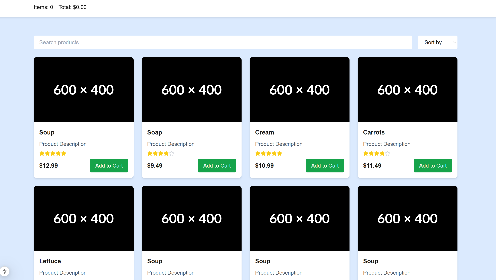

#GreyBall FrontEnd Challenge

The following is an e-commerce product listing page, 
using redux, react, next.js, tailwind and jest for testing.

- it allows the user to select items to add to a cart, with a total price and quantity of items
- search by typing, sort by price or rating
- use infinite scroll (page has a 10 card limit)



To run the development server:

```bash
npm run dev
# or
yarn dev
# or
pnpm dev
# or
bun dev
```

Open [http://localhost:3000](http://localhost:3000) with your browser to see the result.